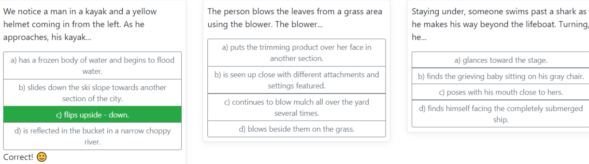

# Bert

## BERT Pre-training Task

- Task #1: Masked LM
  - The training data generatorchooses **15%** of the token positions at random forprediction. If the i-th token is chosen, we replacethe i-th token with
  - (1) the **[MASK] token 80%** ofthe time
  - (2) a **random token 10%** of the time
  - (3)the **unchanged i-th token 10%** of the time. Then,Ti will be used to predict the original token withcross entropy loss.
- Task #2: Next Sentence Prediction (NSP)
  - 具体地说，当为每个预训练示例选择句子A和B时，**50%的时间B是A之后的实际下一句**(标记为IsNext)，**50%的时间是来自语料库的随机句子**(标记为NotNext)。

## BERT fine-tuning

### GLUE

GLUE的官网为：https://gluebenchmark.com/

GLUE共有九个任务，分别是CoLA、SST-2、MRPC、STS-B、QQP、MNLI、QNLI、RTE、WNLI。注意这些任务基本都是分类任务，是自然语言处理中分类任务的Benchmark

#### **CoLA**

CoLA(The Corpus of Linguistic Acceptability，语言可接受性语料库)，**单句子分类任务**，语料来自语言理论的书籍和期刊，每个句子被标注为是否合乎语法的单词序列。本任务是一个二分类任务，标签共两个，分别是0和1，其中0表示不合乎语法，1表示合乎语法。

样本个数：训练集8, 551个，开发集1, 043个，测试集1, 063个。

任务：可接受程度，合乎语法与不合乎语法二分类。

评价准则：**[Matthews correlation coefficient](https://blog.csdn.net/ARPOSPF/article/details/84997220)**。

标签为1（合乎语法）的样例：

- She is proud.
- she is the mother.
- John thinks Mary left.
- Yes, she did.
- Will John not go to school?
- Mary noticed John's excessive appreciation of himself.

标签为0（不合语法）的样例：

- Mary sent.
- Yes, she used.
- Mary wonders for Bill to come.
- They are intense of Bill.
- Mary thinks whether Bill will come.
- Mary noticed John's excessive appreciation of herself.

注意到，这里面的句子看起来不是很长，有些错误是性别不符，有些是缺词、少词，有些是加s不加s的情况，各种语法错误。但我也注意到，有一些看起来错误并没有那么严重，甚至在某些情况还是可以说的通的。

#### **SST-2**

SST-2(The Stanford Sentiment Treebank，斯坦福情感树库)，**单句子分类任务**，包含电影评论中的句子和它们情感的人类注释。这项任务是给定句子的情感，类别分为两类正面情感（positive，样本标签对应为1）和负面情感（negative，样本标签对应为0），并且只用句子级别的标签。也就是，本任务也是一个二分类任务，针对句子级别，分为正面和负面情感。

样本个数：训练集67, 350个，开发集873个，测试集1, 821个。

任务：情感分类，正面情感和负面情感二分类。

评价准则：**accuracy**。

标签为1（正面情感，positive）的样例：

- two central performances
- against shimmering cinematography that lends the setting the ethereal beauty of an asian landscape painting
- the situation in a well-balanced fashion
- a better movie
- at achieving the modest , crowd-pleasing goals it sets for itself
- a patient viewer

标签为0（负面情感，negative）的样例：

- a transparently hypocritical work that feels as though it 's trying to set the women 's liberation movement back 20 years
- so pat it makes your teeth hurt
- blood work is laughable in the solemnity with which it tries to pump life into overworked elements from eastwood 's dirty harry period .
- faced with the possibility that her life is meaningless , vapid and devoid of substance , in a movie that is definitely meaningless , vapid and devoid of substance
- monotone
- this new jangle of noise , mayhem and stupidity must be a serious contender for the title .

注意到，由于句子来源于电影评论，又有它们情感的人类注释，不同于CoLA的整体偏短，有些句子很长，有些句子很短，长短并不整齐划一。

#### **MRPC**

MRPC(The Microsoft Research Paraphrase Corpus，微软研究院释义语料库)，**相似性和释义任务**，是从在线新闻源中自动抽取句子对语料库，并人工注释句子对中的句子是否在语义上等效。类别并不平衡，其中68%的正样本，所以遵循常规的做法，报告准确率（accuracy）和F1值。

样本个数：训练集3, 668个，开发集408个，测试集1, 725个。

任务：是否释义二分类，是释义，不是释义两类。

评价准则：**准确率（accuracy）和F1值**。

标签为1（正样本，互为释义）的样例（每个样例是两句话，中间用tab隔开）：

- The largest gains were seen in prices , new orders , inventories and exports . Sub-indexes measuring prices , new orders , inventories and exports increased .
- Trading in Loral was halted yesterday ; the shares closed on Monday at $ 3.01 . The New York Stock Exchange suspended trading yesterday in Loral , which closed at $ 3.01 Friday .
- He plans to have dinner with troops at Kosovo 's U.S. military headquarters , Camp Bondsteel . After that , he plans to have dinner at Camp Bondsteel with U.S. troops stationed there .
- Retailers J.C. Penney Co . Inc . ( JCP ) and Walgreen Co . ( WAG ) kick things off on Monday . Retailers J.C. Penney Co . Inc . JCP.N and Walgreen Co . WAG.N kick things off on Monday .
- Prosecutors filed a motion informing Lee they intend to seek the death penalty . He added that prosecutors will seek the death penalty .
- Last year the court upheld Cleveland 's school voucher program , ruling 5-4 that vouchers are constitutional if they provide parents a choice of religious and secular schools . Last year , the court ruled 5-4 in an Ohio case that government vouchers are constitutional if they provide parents with choices among a range of religious and secular schools .

标签为0（负样本，不互为释义）的样例：

- Earnings per share from recurring operations will be 13 cents to 14 cents . That beat the company 's April earnings forecast of 8 to 9 cents a share .
- He beat testicular cancer that had spread to his lungs and brain . Armstrong , 31 , battled testicular cancer that spread to his brain .
- Graves reported from Albuquerque , Villafranca from Austin and Ratcliffe from Laredo . Pete Slover reported from Laredo and Gromer Jeffers from Albuquerque .
- The commission must work out the plan 's details , but the average residential customer paying $ 840 a year would get a savings of about $ 30 annually . An average residential customer paying $ 840 a year for electricity could see a savings of $ 30 annually .
- A former teammate , Carlton Dotson , has been charged with the murder . His body was found July 25 , and former teammate Carlton Dotson has been charged in his shooting death .
- The battles marked day four of a U.S. sweep to hunt down supporters of Saddam Hussein 's fallen regime . Twenty-seven Iraqis were killed , pushing the number of opposition deaths to about 100 in a U.S. operation to hunt down supporters of Saddam Hussein 's fallen regime .

本任务的数据集，包含两句话，每个样本的句子长度都非常长，且数据不均衡，正样本占比68%，负样本仅占32%。

#### **STSB**

STSB(The Semantic Textual Similarity Benchmark，语义文本相似性基准测试)，相似性和释义任务，是从新闻标题、视频标题、图像标题以及自然语言推断数据中提取的句子对的集合，每对都是由人类注释的，其相似性评分为0-5(大于等于0且小于等于5的浮点数，原始paper里写的是1-5，可能是作者失误）。任务就是预测这些相似性得分，本质上是一个回归问题，但是依然可以用分类的方法，可以归类为句子对的文本五分类任务。

样本个数：训练集5, 749个，开发集1, 379个，测试集1, 377个。

任务：**回归任务，预测为1-5之间的相似性得分的浮点数。但是依然可以使用分类的方法，作为五分类。**

评价准则：**[Pearson](https://zh.wikipedia.org/wiki/皮尔逊积矩相关系数) and [Spearman](https://zh.wikipedia.org/wiki/斯皮尔曼等级相关系数) correlation coefficients**。

一些训练集中的样例句子对及其得分：

- A plane is taking off. An air plane is taking off. 5.000
- A man is playing a large flute. A man is playing a flute. 3.800
- A dog rides a skateboard. A dog is riding a skateboard. 5.000
- A woman is playing the flute. A man is playing the guitar. 1.000
- A man is playing the guitar. A man is playing the drums. 1.556
- A cat is playing a piano. A man is playing a guitar. 0.600
- A group of people dance on a hill. A group of people are dancing. 3.200
- A woman is sitting at a desk. A woman is riding a donkey. 0.400
- Someone is slicing tortila's. Someone is riding a horse. 0.000
- A man is playing the guitar. A man plays an acoustic guitar. 3.750

整体句子长度适中偏短，且均衡。

#### **QQP**

QQP(The Quora Question Pairs, Quora问题对数集)，相似性和释义任务，是社区问答网站Quora中问题对的集合。任务是确定一对问题在语义上是否等效。与MRPC一样，QQP也是正负样本不均衡的，不同是的QQP负样本占63%，正样本是37%，所以我们也是报告准确率和F1值。我们使用标准测试集，为此我们从作者那里获得了专用标签。我们观察到测试集与训练集分布不同。

样本个数：训练集363, 870个，开发集40, 431个，测试集390, 965个。

任务：判定句子对是否等效，等效、不等效两种情况，**二分类任务**。

评价准则：**准确率（accuracy）和F1值**。

标签为1（正样本，互为释义，等效）的样例（每个样例是两句话，中间用tab隔开）：

- How can I improve my communication and verbal skills? What should we do to improve communication skills?
- What has Hillary Clinton done that makes her trustworthy? Why do Democrats consider Hillary Clinton trustworthy?
- What are the top countries worth visiting? What are the top ten countries you think are most worth visiting in your lifetime, and why?
- hat would happen if all the people in the world didn't need to sleep? Where would humans be if we didn't need sleep?
- Why is Russia improving relations with Israel so much in 2016? Why is Russia and Israel improving relations with each other so much as of 2016?
- hy does the iPad Mini say not charging? Why is my iPad Mini not charging?

标签为0（负样本，不互为释义，不等效）的样例：

- Why are you so sexy? How sexy are you?
- Which programming languages are common to develop in the area of gamification? Who is the worst Director in the history of MNIT/MREC?
- How do I solve 3^1/3? How do I solve (x^2-1) /(x-3) <0?
- Why is the Mophie case charged by a micro-USB cable, and not a lightning cable? Which USB hub should I buy?
- Can we do a mobile recharge using the BHIM app? How do I select state bank of Patiala in bhim app?
- What is the feeling of love? What it feels to be loved?

类似于MRPC，句子对的释义问题。这里突出的除了样本不均衡、训练集测试集分布不一致外，还有这个训练集、测试集都非常大。这里的测试集比其他训练集都要多好几倍。

#### **MNLI**

MNLI(The Multi-Genre Natural Language Inference Corpus, 多类型自然语言推理数据库)，**自然语言推断任务**，是通过众包方式对句子对进行文本蕴含标注的集合。给定前提（premise）语句和假设（hypothesis）语句，任务是预测前提语句是否包含假设（蕴含, entailment），与假设矛盾（矛盾，contradiction）或者两者都不（中立，neutral）。前提语句是从数十种不同来源收集的，包括转录的语音，小说和政府报告。

样本个数：训练集392, 702个，开发集dev-matched 9, 815个，开发集dev-mismatched9, 832个，测试集test-matched 9, 796个，测试集test-dismatched9, 847个。因为MNLI是集合了许多不同领域风格的文本，所以又分为了matched和mismatched两个版本的数据集，matched指的是训练集和测试集的数据来源一致，mismached指的是训练集和测试集来源不一致。

任务：句子对，一个前提，一个是假设。前提和假设的关系有三种情况：蕴含（entailment），矛盾（contradiction），中立（neutral）。句子对**三分类**问题。

评价准则：**matched accuracy/mismatched accuracy**。

标签为蕴含（entailment）的句子对示例：

- you know during the season and i guess at at your level uh you lose them to the next level if if they decide to recall the the parent team the Braves decide to call to recall a guy from triple A then a double A guy goes up to replace him and a single A guy goes up to replace him You lose the things to the following level if the people recall.
- ow do you know? All this is their information again. This information belongs to them.
- well you see that on television also You can see that on television, as well.
- According to the Office of the Actuary at the Health Care Financing Administration, the estimated net present value of future additional resources needed to fund HI benefits alone over the 75 years is $4. The net present value of future additional resources for funding HI benefits was $4.

标签为矛盾（contradiction）的句子对示例：

- They're made from a secret recipe handed down to the present-day villagers by their Mallorcan ancestors, who came here in the early 17th century as part of an official repopulation scheme. The recipe passed down from Mallorcan ancestors is known to everyone.
- Felicia's Journey takes place behind the eyes of its central a young Irish girl, Felicia, who crosses the sea to England in a hopeful quest to find the father of her unborn child; and the fat, middle-aged catering manager, Hiditch, who takes a paternal interest in the lass when it becomes clear that her young man has caddishly given her the slip. The woman did not care where the man was as long as it was far.
- Poirot, I exclaimed, with relief, and seizing him by both hands, I dragged him into the room. Poirot was now back and I was sorry that he would take over what I now considered my own investigation.
- but that takes too much planning It doesn't take much planning.

标签为中立（neutral）的句子对示例：

- Conceptually cream skimming has two basic dimensions - product and geography. Product and geography are what make cream skimming work.
- hebes held onto power until the 12th Dynasty, when its first king, Amenemhet Iwho reigned between 1980 1951 b.c. established a capital near Memphis. The capital near Memphis lasted only half a century before its inhabitants abandoned it for the next capital.
- When the trust fund begins running cash deficits in 2016, the government as a whole must come up with the cash to finance Social Security's cash deficit by reducing any projected non-Social Security surpluses, borrowing from the public, raising other taxes, or reducing other government spending. The public would generally prefer to see the government reduce its spending in other areas to finance Social Security.
- She smiled back. She was so happy she couldn't stop smiling.

总体训练集很充足，GLUE论文作者使用并推荐SNLI数据集为辅助训练数据。

#### **QNLI**

QNLI(Qusetion-answering NLI，问答自然语言推断)，自然语言推断任务。QNLI是从另一个数据集The Stanford Question Answering Dataset(斯坦福问答数据集, SQuAD 1.0)[[3\]](https://zhuanlan.zhihu.com/p/135283598#ref_3)转换而来的。SQuAD 1.0是有一个问题-段落对组成的问答数据集，其中段落来自维基百科，段落中的一个句子包含问题的答案。这里可以看到有个要素，来自维基百科的段落，问题，段落中的一个句子包含问题的答案。通过将问题和上下文（即维基百科段落）中的每一句话进行组合，并过滤掉词汇重叠比较低的句子对就得到了QNLI中的句子对。相比原始SQuAD任务，消除了模型选择准确答案的要求；也消除了简化的假设，即答案适中在输入中并且词汇重叠是可靠的提示。

样本个数：训练集104, 743个，开发集5, 463个，测试集5, 461个。

任务：判断问题（question）和句子（sentence，维基百科段落中的一句）是否蕴含，蕴含和不蕴含，**二分类**。

评价准则：**准确率（accuracy）**。

标签为蕴含（entailment，正样本）的样例（每个样例是两句话，中间用tab隔开，第一句是问题，第二句是上下文中的一句）：

- What did Arsenal consider the yellow and blue colors to be after losing a FA Cup final wearing red and white? Arsenal then competed in three consecutive FA Cup finals between 1978 and 1980 wearing their "lucky" yellow and blue strip, which remained the club's away strip until the release of a green and navy away kit in 1982–83.
- Which collection of minor poems are sometimes attributed to Virgil? A number of minor poems, collected in the Appendix Vergiliana, are sometimes attributed to him.
- What does confrontational scavenging involve doing to other predators after they've made a kill? Robert Blumenschine proposed the idea of confrontational scavenging, which involves challenging and scaring off other predators after they have made a kill, which he suggests could have been the leading method of obtaining protein-rich meat by early humans.
- Why were dogs initially selected? Unlike other domestic species which were primarily selected for production-related traits, dogs were initially selected for their behaviors.
- What is the term that refers to areas where an antennas radiation is zero? The radiation of many antennas shows a pattern of maxima or "lobes" at various angles, separated by "nulls", angles where the radiation falls to zero.
- Why do people say KInseys work is not correct? Kinsey's methods have been criticized as flawed, particularly with regard to the randomness of his sample population, which included prison inmates, male prostitutes and those who willingly participated in discussion of previously taboo sexual topics.

标签为不蕴含（not_entailment，负样本）的样例（每个样例是两句话，中间用tab隔开，第一句是问题，第二句是上下文中的一句）：

- When did the third Digimon series begin? Unlike the two seasons before it and most of the seasons that followed, Digimon Tamers takes a darker and more realistic approach to its story featuring Digimon who do not reincarnate after their deaths and more complex character development in the original Japanese.
- While looking for bugs, what else can testing do? Although testing can determine the correctness of software under the assumption of some specific hypotheses (see hierarchy of testing difficulty below), testing cannot identify all the defects within software.
- What was the highest order of species n land? The climate was much more humid than the Triassic, and as a result, the world was very tropical.
- In what century was the church established at the location? Construction of the present church began in 1245, on the orders of King Henry III.
- In what century was the church established at the location? Construction of the present church began in 1245, on the orders of King Henry III.
- Do the roots and shoots need each other? Roots that spread out close to the surface, such as those of willows, can produce shoots and ultimately new plants.

总体就是问答句子组成的问答对，一个是问题，一个是句子信息，后者包含前者的答案就是蕴含，不包含就是不蕴含，是一个二分类。

#### **RTE**

RTE(The Recognizing Textual Entailment datasets，识别文本蕴含数据集)，自然语言推断任务，它是将一系列的年度文本蕴含挑战赛的数据集进行整合合并而来的，包含RTE1，RTE2，RTE3，RTE5等，这些数据样本都从新闻和维基百科构建而来。将这些所有数据转换为二分类，对于三分类的数据，为了保持一致性，将中立（neutral）和矛盾（contradiction）转换为不蕴含（not entailment）。

样本个数：训练集2, 491个，开发集277个，测试集3, 000个。

任务：判断句子对是否蕴含，句子1和句子2是否互为蕴含，**二分类任务**。

评价准则：**准确率（accuracy）**。

标签为蕴含（entailment，正样本）的样例（每个样例是两句话，中间用tab隔开）：

- A place of sorrow, after Pope John Paul II died, became a place of celebration, as Roman Catholic faithful gathered in downtown Chicago to mark the installation of new Pope Benedict XVI. Pope Benedict XVI is the new leader of the Roman Catholic Church.
- Herceptin was already approved to treat the sickest breast cancer patients, and the company said, Monday, it will discuss with federal regulators the possibility of prescribing the drug for more breast cancer patients. Herceptin can be used to treat breast cancer.
- The name for the newest James Bond film has been announced today. The 22nd film, previously known only as "Bond 22", will be called "Quantum of Solace". EON Productions who are producing the film made the announcement today at Pinewood Studios, where production for the film has been under way since last year. The name of the film was inspired by a short story (of the same name) from For Your Eyes Only by Bond creator, Ian Fleming. James Bond was created by Ian Fleming.
- The gastric bypass operation, also known as stomach stapling, has become the most common surgical procedure for treating obesity. Obesity is medically treated.

标签为不蕴含（not_entailment，正样本）的样例（每个样例是两句话，中间用tab隔开）：

- No Weapons of Mass Destruction Found in Iraq Yet. Weapons of Mass Destruction Found in Iraq.
- Sierra is likely to remain in jail at the Hillsborough County jail in her native Tampa until her next hearing on December 20, where she is being held without bail, which would prevent her attending the Washington event on Friday even if she still had permission to perform. Sierra has been in jail since the start of the month after an altercation with police officers outside a Tampa nightclub, which she had been ejected from. She is charged with disorderly intoxication and resisting arrest. Sierra once reached the finals of "American Idol".
- Since 1987, however, Brazil has taken steps to dramatically reduce the destruction, including stepped-up enforcement and the elimination of tax incentives that led to large-scale land clearing. In the early 1990s Brazil began to take action to save the rainforest.
- The ferry owner PT Nur Budi's spokesman blamed Indonesian port authorities for the tragedy. "The passenger capacity of the ferry is 205 people but the port administrator accepted more passengers as they thought it was possible," he said. The National Meteorological and Geophysics Agency, however, had published and raised an alert signal about high waves on Friday. It specifically stated that "Saturday 10th and Sunday 11th, Indonesian waters would have witnessed storm force waves," but despite the dire warnings KM Teratai set for the seas. An Indonesian ferry with 300 passengers sank.

#### **WNLI**

WNLI(Winograd NLI，Winograd自然语言推断)，自然语言推断任务，数据集来自于竞赛数据的转换。Winograd Schema Challenge，该竞赛是一项阅读理解任务，其中系统必须读一个带有代词的句子，并从列表中找到代词的指代对象。这些样本都是都是手动创建的，以挫败简单的统计方法：每个样本都取决于句子中单个单词或短语提供的上下文信息。为了将问题转换成句子对分类，方法是通过用每个可能的列表中的每个可能的指代去替换原始句子中的代词。任务是预测两个句子对是否有关（蕴含、不蕴含）。训练集两个类别是均衡的，测试集是不均衡的，65%是不蕴含。

样本个数：训练集635个，开发集71个，测试集146个。

任务：判断句子对是否相关，蕴含和不蕴含，**二分类任**务。

评价准则：**准确率（accuracy）**。

标签为1（蕴含，entailment，正样本）的样例（每个样例是两句话，中间用tab隔开）：

- The actress used to be named Terpsichore, but she changed it to Tina a few years ago, because she figured it was too hard to pronounce. Terpsichore was too hard to pronounce.
- Since Chester was dependent on Uncle Vernon, he couldn't very well marry without his approval He couldn't very well marry without Uncle Vernon's approval
- When they had eventually calmed down a bit, and had gotten home, Mr. Farley put the magic pebble in an iron safe. Some day they might want to use it , but really for now, what more could they wish for? Some day they might want to use the magic pebble.
- The actress used to be named Terpsichore, but she changed it to Tina a few years ago, because she figured it was easier to pronounce. Tina was easier to pronounce.
- Frank was upset with Tom because the toaster he had sold him didn't work. The toaster Tom had sold him didn't work.
- My meeting started at 4:00 and I needed to catch the train at 4:30, so there wasn't much time. Luckily, it was delayed, so it worked out. The train was delayed, so it worked out.

标签为0（不蕴含，not_entailment，正样本）的样例（每个样例是两句话，中间用tab隔开）：

- Bill passed the half-empty plate to John because he was hungry. Bill was hungry.
- The donkey wished a wart on its hind leg would disappear, and it did. The donkey wished a wart on its hind leg would disappear, and leg did.
- The man lifted the boy onto his shoulders. The man lifted the boy onto the boy's shoulders.
- The delivery truck zoomed by the school bus because it was going so slow. The delivery truck was going so slow.
- We went to the lake, because a shark had been seen at the ocean beach, so it was a safer place to swim. The ocean beach was a safer place to swim.
- rchaeologists have concluded that humans lived in Laputa 20,000 years ago. They hunted for evidence on the river banks. Prehistoric humans hunted for evidence on the river banks.

使用以下几个官方的下载方法（需要科学上网）：

- 官方的下载链接：https://gluebenchmark.com/tasks
- 下载数据的脚本：https://gist.github.com/W4ngatang/60c2bdb54d156a41194446737ce03e2e

### SQuAD v1.1

SQuAD 是斯坦福大学于2016年推出的数据集，一个**阅读理解数据集**，给定一篇文章，准备相应问题，需要算法给出问题的答案。此数据集所有文章选自维基百科，数据集的量为当今其他数据集(例如，WikiQA)的**几十倍之多**。一共有**107,785问题，以及配套的 536 篇文章** 标准的QA benchmark

### SQuAD v2.0

[SQuAD — text span答案类型开创者](https://zhuanlan.zhihu.com/p/137828922)

### SWAG

[Situations With Adversarial Generations](https://rowanzellers.com/swag/)是一个由113k多项选择问题组成的数据集，这些问题涉及丰富的基础情境。

Given a partial description like "she opened the hood of the car," humans can reason about the situation and anticipate what might come next ("then, she examined the engine"). SWAG (Situations With Adversarial Generations) is a large-scale dataset for this task of grounded commonsense inference, unifying natural language inference and physically grounded reasoning.

The dataset consists of 113k multiple choice questions about grounded *situations*. Each question is a video caption from [LSMDC](https://sites.google.com/site/describingmovies/lsmdc-2017) or [ActivityNet Captions](https://cs.stanford.edu/people/ranjaykrishna/densevid/), with four answer choices about what might happen next in the scene. The correct answer is the (real) video caption for the next event in the video; the three incorrect answers are [adversarially generated](https://rowanzellers.com/swag/#af) and human verified, so as to fool machines but not humans. We aim for SWAG to be a benchmark for evaluating grounded commonsense NLI and for learning representations.

## Q&A

1. **为什么Bert做不好无监督语义匹配？**

- **Bert向量空间并不平滑，有些区域不好被定义，也就是说是存在问题的，导致简单的相似性度量不能很好起到度量作用**。
- 简单说就是Bert输出向量语义信息是足够的，但是consine这种简单东西不能很好的度量出来而已。那么就有大致两个解决办法：转化Bert的输出空间或者使用其他的有用的相似性度量函数。

- [On the Sentence Embeddings from Pre-trained Language Models](https://arxiv.org/pdf/2011.05864.pdf,)

- 简单来说，就是Bert的向量空间存在各向异性（anisotropic）：

  1. 高频离原点近，低频离原点远
  2. 高频分布紧密，低频分布稀疏

  这两个现象的存在导致Bert的语义信息不能很好的表达出来，所以做语义相似度不好。

2. **什么是蒸馏？**

- 一般来说，为了提高模型效果，我们可以使用两种方式。一种是直接使用复杂模型，比如你原来使用的TextCNN，现在使用Bert。一种是多个简单模型的集成，这种套路在竞赛中非常的常见。
- 这两种方法在离线的时候是没有什么问题的，因为不涉及到实时性的要求。但是一旦涉及到到部署模型，线上实时推理，我们需要考虑时延和计算资源，一般需要对模型的复杂度和精度做一个平衡。
- 这个时候，我们就可以将我们大模型学到的信息提取精华灌输到到小模型中去，这个过程就是蒸馏。

## Understand

### 演变史

#### one-hot 存在问题?

- 问题：
  - 维度灾难：容易受维数灾难的困扰，每个词语的维度就是语料库字典的长度；
  - 离散、稀疏问题：因为 one-Hot 中，句子向量，如果词出现则为1，没出现则为0，但是由于维度远大于句子长度，所以句子中的1远小于0的个数；
  - 维度鸿沟问题：词语的编码往往是随机的，导致不能很好地刻画词与词之间的相似性。

#### wordvec 存在问题?

- 多义词问题
  - 因为 word2vec 为静态方式，即训练好后，每个词表达固定；

#### fastText 存在问题?

- 多义词问题
  - 因为 word2vec 为静态方式，即训练好后，每个词表达固定；

#### elmo 存在问题?

- 问题：
  - 在做序列编码任务时，使用 LSTM；
  - ELMo 采用双向拼接的融合特征，比Bert一体化融合特征方式弱；

### Bert 介绍篇

#### Bert 是什么?

- BERT（Bidirectional Encoder Representations from Transformers）是一种**Transformer的双向编码器**，旨在**通过在左右上下文中共有的条件计算来预先训练来自无标号文本的深度双向表示**。因此，经过预先训练的BERT模型只需一个额外的输出层就可以进行微调，从而为各种自然语言处理任务生成最新模型。

- 这个也是我们常说的 **【预训练】+【微调】**

#### Bert 三个关键点？

- 基于 transformer 结构
- 大量语料预训练：
  - 介绍：在包含整个维基百科的无标签号文本的大语料库中（足足有25亿字！） 和图书语料库（有8亿字）中进行预训练；
  - 优点：大语料 能够 覆盖 更多 的 信息；
- 双向模型：
  - BERT是一个“深度双向”的模型。双向意味着BERT在训练阶段从所选文本的左右上下文中汲取信息

#### Bert 输入输出表征长啥样？

- input 组成：
  - Token embedding 字向量: BERT模型通过查询字向量表将文本中的每个字转换为一维向量，作为模型输入；
  - Segment embedding 文本向量: 该向量的取值在模型训练过程中自动学习，用于刻画文本的全局语义信息，并与单字/词的语义信息相融合；
  - Position embedding 位置向量：由于出现在文本不同位置的字/词所携带的语义信息存在差异（比如：“我爱你”和“你爱我”），因此，BERT模型对不同位置的字/词分别附加一个不同的向量以作区分
- output 组成：输入各字对应的融合全文语义信息后的向量表示

#### Bert 预训练任务？

- 预训练 包含 两个 Task:
  - Task 1：Masked LM
  - Task 2：Next Sentence Prediction

##### Bert 为什么需要预训练任务 Masked LM ？

- 普通的自注意力模块允许一个位置看到它左右侧单词的信息，使得 每个词 都能 通过多层 上下文 “看到自己”；

#####  Bert 预训练任务 Masked LM 怎么做？

- (1) the **[MASK] token 80%** ofthe time
- (2) a **random token 10%** of the time
- (3)the **unchanged i-th token 10%** of the time. 

##### Bert 预训练任务 Masked LM 存在问题？

- 预训练和微调之间的不匹配：在微调期间从未看到[MASK]词块
- 收敛速度慢问题：每 batch 中只预测了15％的词块，导致 收敛速度慢

##### Bert 为什么需要预训练任务 Next Sentence Prediction ？

- 动机：很多重要的下游任务，例如问答(QA)和自然语言推理(NLI)，都是基于对两个文本句子间关系的理解，而这种关系并非通过语言建模直接获得

##### Bert 预训练任务 Next Sentence Prediction 怎么做？

- 方法：
  - 预训练 一个 二值化 NSP 任务 学习 句子间关系；
- 操作：
  - 选择句子A和B作为预训练样本：B有50%的可能是A的下一句，也有50%的可能是来自语料库的随机句子

#### 为什么 Bert 需要 fine-turning？

- 动机：获得输入序列的固定维度池化表征

#### Bert 如何 fine-turning？

- 对该输入第一个词块采取最终隐藏状态(例如，该变换器输出)，通过对应于特殊[CLS]词嵌入来构造。我们将该向量表示为$C∈R^H$。
- 微调期间添加的唯一新参数是分类层向量$W∈R^{KxH}$，其中K是分类器标签的数量。
- 该标签概率$P∈R^K$用标准softmax函数，P=softmax(CWT)计算。BERT和W的所有参数都经过联动地微调，以最大化正确标签的对数概率

#### BERT的两个预训练任务对应的损失函数是什么(用公式形式展示)？

- Bert 损失函数组成：
  - 第一部分是来自 Mask-LM 的单词级别分类任务；
  - 另一部分是句子级别的分类任务；
- 优点：通过这两个任务的联合学习，可以使得 BERT 学习到的表征既有 token 级别信息，同时也包含了句子级别的语义信息。
- 损失函数

> 注：
> θ：BERT 中 Encoder 部分的参数；
> θ1：是 Mask-LM 任务中在 Encoder 上所接的输出层中的参数；
> θ2：是句子预测任务中在 Encoder 接上的分类器参数

- 在第一部分的损失函数中，如果被 mask 的词集合为 M，因为它是一个词典大小 |V| 上的多分类问题，所用的损失函数叫做负对数似然函数（且是最小化，等价于最大化对数似然函数），那么具体说来有：

- 在第二部分的损失函数中，在句子预测任务中，也是一个分类问题的损失函数：

- 两个任务联合学习的损失函数是：

#### GPT和BERT有什么不同？

- GPT-2 是使用「transformer 解码器模块」构建的
- BERT 则是通过「transformer 编码器」模块构建的。

### Bert 模型压缩篇

#### Bert的优缺点？

- Bert 优点：
  - 对下游任务进行微调后，显著提高了模型的表现；
- Bert 缺点：
  - 内存占用；
  - 功耗过高；
  - 带来很高的延迟；
  - 限制了 Bert 系列模型在移动和物联网等嵌入式设备上的部署；

- [关于 Bert 压缩](https://github.com/km1994/NLP-Interview-Notes/tree/main/NLPinterview/PreTraining/bert_zip)

## Source Code

- [Bert 源码解析I 之 主体篇](https://github.com/km1994/NLP-Interview-Notes/blob/main/NLPinterview/PreTraining/bert/bertCode1_modeling.md)
- [Bert 源码解析II 之 预训练篇](https://github.com/km1994/NLP-Interview-Notes/blob/main/NLPinterview/PreTraining/bert/bertCode2_pretraining.md)
- [Bert 源码解析III 之 微调篇](https://github.com/km1994/NLP-Interview-Notes/blob/main/NLPinterview/PreTraining/bert/bertCode3_fineTune.md)
- [关于 Bert 源码解析IV 之 句向量生成篇](https://github.com/km1994/NLP-Interview-Notes/blob/main/NLPinterview/PreTraining/bert/bertCode4_word2embedding.md)
- [Bert 源码解析V 之 文本相似度 篇](https://github.com/km1994/NLP-Interview-Notes/blob/main/NLPinterview/PreTraining/bert/bertCode5_similarity.md)

