# 机器学习基础

## 过拟合和欠拟合

#### 过拟合和欠拟合是什么？

- 欠拟合和过拟合属于对立情况，都是**导致模型泛化能力不高的两种常见原因**，均是模型学习能力和数据复杂性失调的表现
- 过拟合/高方差（overfiting / high variance）
- 欠拟合/高偏差（underfiting / high bias）

#### 过拟合是什么及检验方法？

- 问题表现方式：高方差
  - 如果 **训练集和测试集的误差间呈现较大的差异时，即为高方差**;
  - 在高方差时，训练集训练效果很好， 但是验证集的验证效果很差的时候， 即训练集和验证集呈现出较大的差异，即模型的**泛化能力差**。这种现象称为过拟合;

- 检验方法：此时，观察模型在训练集和测试集上的损失函数值随着epoch的变化情况，**当模型在测试集上的损失函数值出现先下降后上升**，那么此时可能出现过拟合。

#### 导致过拟合的原因是什么？

1. **训练集数量不足，样本类型单一**。例如：如果 我们 利用 只包含 负样本的训练集 训练 模型，然后利用训练好的模型 预测 验证集中 的 正样本时，此时就会出现，模型 在 训练的时候，效果特别好，但是在验证的时候效果下降问题。因此，在选取训练集时，应当覆盖所有的数据类型；
2. **训练集中存在噪声**。噪声指的是 训练数据中 的 干扰数据，噪声数据 会 误导模型 记录 较多 的 错误特征，而 忽略了 真实样本 中 的正确特征信息；
3. **模型复杂度过高**。当模型过于复杂时，会导致 模型 过于充分 的 学习到 训练数据集中特征信息，但是遇到没有见过的数据的时候不能够变通，泛化能力太差。我们希望模型对不同的数据都有稳定的输出。模型太复杂是过拟合的重要因素。

#### 过拟合的解决方法是什么？

1. **标注不同类型的样本**，是 样本尽可能的均衡。数据经过**清洗之后再进行模型训练，防止噪声数据干扰模型**，**增强数据**；
2. **降低训练模型复杂度**。在训练和建立模型的时候，从相对简单的模型开始，不要一开始就把特征做的非常多，模型参数挑的非常复杂；
3. **正则化**。在模型算法中添加惩罚函数来防止模型出现过拟合问题。常见的有L1，L2，dropout 正则化等。而且 L1正则还可以自动进行特征选择；
4. **采用 bagging(如随机森林等）集成学习方法 来 防止过拟合**；
5. **减少特征个数**(不是太推荐，但也是一种方法)。可以使用特征选择，减少特征数或使用较少的特征组合，对于按区间离散化的特征，增大划分的区间；
6. **交叉检验**。利用 交叉检验的方法，来让模型得到充分的训练，以得到较优的模型参数；
7. **早停策略**(Early stopping)。本质上是交叉验证策略，选择合适的训练次数，避免训练的网络过度拟合训练数据；
8. **DropOut策略**。核心思想就是bagging，可以看作是低成本的集成学习。所谓的Dropout指的是在用前向传播算法和反向传播算法训练DNN模型时，一批数据迭代时，随机的从全连接DNN网络中去掉一部分隐藏层的神经元。　在对训练集中的一批数据进行训练时，我们随机去掉一部分隐藏层的神经元，并用去掉隐藏层的神经元的网络来拟合我们的一批训练数据。使用基于dropout的正则化比基于bagging的正则化简单，这显而易见，当然天下没有免费的午餐，由于dropout会将原始数据分批迭代，因此原始数据集最好较大，否则模型可能会欠拟合。

#### 欠拟合是什么及检验方法？

- 问题表现：高偏差
  - 如果 训练集 和 测试集 的 误差 收敛 但是收敛值 很高时，即为高偏差;
  - 虽然 训练集 和 测试集 都可以收敛，但是偏差很高，**训练集和验证集的准确率都很低**，这种现象 称为 欠拟合;

- 检验方法：**模型 无法很好的拟合数据，导致训练集和测试集效果都不佳**。

#### 导致欠拟合的原因是什么？

- **模型复杂度太低**。模型没有充分学习到 数据中的**特征信息**，使得 模型 无法很好地拟合数据
- **特征量太少**

#### 欠拟合的解决方法是什么？

1. **特征工程**。添加更多的特征项，eg：特征组合、高次特征 等，来增大假设空间；
2. **集成学习方法**。boosting（如GBDT）能有效解决 high bias；
3. **提高模型复杂度**。当 所采用的模型比较简单，不能够应对复杂的任务。可以考虑 提升 模型复杂度，选用复杂度更好、学习能力更强的模型。比如说可以使用 SVM 的核函数，增加了模型复杂度，把低维不可分的数据映射到高维空间，就可以线性可分，减小欠拟合；
4. **减小正则化系数**。

## 归一化与标准化

#### 为什么要归一化或标准化？

- **每个维度都是去量纲化的，避免了不同量纲的选取对距离计算产生的巨大影响。**
- 归一化是让**不同维度之间的特征在数值上有一定比较性，可以大大提高分类器的准确性**。
- 标准化更好**保持了样本间距**，**更符合统计学假设**，**加速模型收敛**

#### 什么是标准化，归一化？

- **归一化：** 将数据的值压缩到0到1之间.
- **标准化：** 将数据缩放为均值是0，方差为1的状态

#### 有哪些归一化标准化方法？

- **Min-Max归一化**
- **0 均值标准化（z-score 方法）**

#### 哪些机器学习算法需要做归一化？

- 机器学习算法：
  - 基于距离计算的模型：KNN；
  - 通过梯度下降法求解的模型：线性回归、逻辑回归、支持向量机、神经网络

#### 哪些机器学习算法不需要做归一化？

- 机器学习算法：
  - 树形模型：决策树、随机森林(Random Forest)

- 为什么：
  - 原因1：因为它们**不关心变量的值，而是关心变量的分布和变量之间的条件概率**；
  - 原因2：因为**数值缩放不影响分裂点位置，对树模型的结构不造成影响**。按照特征值进行排序的，排序的顺序不变，那么所属的分支以及分裂点就不会有不同。而且，树模型是不能进行梯度下降的，因为构建树模型（回归树）寻找最优点时是通过寻找最优分裂点完成的，因此树模型是阶跃的，阶跃点是不可导的，并且求导没意义，也就不需要归一化。

## BatchNorm vs LayerNorm

#### 独立同分布（independent and identically distributed）与白化？

- 独立同分布
  - 强相关：Naive Bayes 模型就建立在特征彼此独立的基础之上
  - 弱相关：Logistic Regression 和 神经网络 则在非独立的特征数据上依然可以训练出很好的模型

- 白化【数据预处理步骤】
  - **去除特征间的相关性 -> 独立**；
  - **使所有特征具有相同的均值和方差 -> 同分布**

#### Internal Covariate Shift，ICS？

- 动机：深度神经网络涉及到很多层的叠加，而每一层的参数更新会导致上层的输入数据分布发生变化，通过层层叠加，高层的输入分布变化会非常剧烈，这就使得高层需要不断去重新适应底层的参数更新。为了训好模型，我们需要非常谨慎地去设定学习率、初始化权重、以及尽可能细致的参数更新策略。

#### ICS【每个神经元的输入数据不再是“独立同分布”】问题带来的后果是什么？

1. 上层参数需要不断适应新的输入数据分布，导致学习速度下降；
2. 下层输入的变化可能趋于变大或变小，导致上层落入饱和区，从而学习过早停止；
3. 每层的更新都会影响到其他层，因此每层参数更新策略需要尽可能谨慎；

#### Normalization 的通用框架与基本思想？

- 基本思想：在将 x 送给神经元之前，先对其做平移和伸缩变换， 将 x 的分布规范化成在固定区间范围的标准分布;
- 作用：主要用于**加速网络的收敛**，但也**具有一定程度的正则化效果**。

#### Batch Normalization（纵向规范化）是什么？

- Batch Normalization 于2015年由 Google 提出，开 Normalization 之先河。其规范化针对单个神经元进行，利用网络训练时一个 mini-batch 的数据来计算该神经元 xi 的均值和方差,因而称为 Batch Normalization。

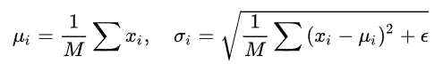

- **BN是对数据的每个维度进行规范化，即对特征进行Norm**，不同的Batch会产生不同的变换。不太适合RNN。

#### Batch Normalization（纵向规范化）适用的场景是什么？

每个 mini-batch 比较大，数据分布比较接近。在进行训练之前，要做好充分的 shuffle. 否则效果会差很多。

#### BatchNorm 存在什么问题？

1. **BN特别依赖Batch Size**；当**Batch size很小的时候，BN的效果就非常不理想了**。在很多情况下，**Batch size大不了，因为你GPU的显存不够**。所以，通常会有其他比较麻烦的手段去解决这个问题，比如MegDet的CGBN等；
2. **BN对处理序列化数据的网络比如RNN是不太适用的**；
3. **BN只在训练的时候用，inference的时候不会用到**，因为inference的输入不是批量输入。

#### Layer Normalization（横向规范化）是什么？

- LN 是一种横向的规范化，它综**合考虑一层所有维度的输入，计算该层的平均输入值和输入方差，然后用同一个规范化操作来转换各个维度的输入。**

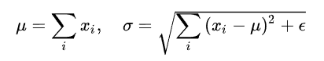

#### Layer Normalization（横向规范化）有什么用？

- **LN 针对单个训练样本进行，不依赖于其他数据**，因此可以避免 BN 中受 mini-batch 数据分布影响的问题，可以用于 小mini-batch场景、动态网络场景和 RNN，特别是自然语言处理领域。此外，**LN 不需要保存 mini-batch 的均值和方差，节省了额外的存储空间**。

#### BN vs LN 比较？

- BN 的转换是针对单个神经元可训练的——不同神经元的输入经过再平移和再缩放后分布在不同的区间，而 LN 对于一整层的神经元训练得到同一个转换——所有的输入都在同一个区间范围内。如果不同输入特征不属于相似的类别（比如颜色和大小），那么 LN 的处理可能会降低模型的表达能力。

#### 主流 Normalization 方法为什么有效？

- Normalization 的权重伸缩不变性，权重伸缩不变性可以有效地提高反向传播的效率
- Normalization 的数据伸缩不变性，数据伸缩不变性可以有效地减少梯度弥散，简化对学习率的选择

#### 主流Normalization 方法所有种类？

- 常用的Normalization方法主要有：Batch Normalization（BN，2015年）、Layer Normalization（LN，2016年）、Instance Normalization（IN，2017年）、Group Normalization（GN，2018年）

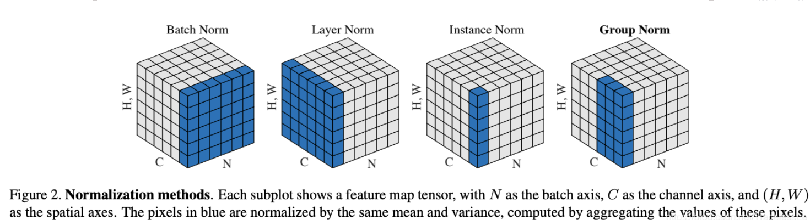

- 我们将输入的 feature map shape 记为[N, C, H, W]，其中N表示batch size，即N个样本；C表示通道数；H、W分别表示特征图的高度、宽度。这几个方法主要的区别就是在：

  1. BN是在batch上，对N、H、W做归一化，而保留通道 C 的维度。BN对较小的batch size效果不好。BN适用于固定深度的前向神经网络，如CNN，不适用于RNN；

  2. LN在通道方向上，对C、H、W归一化，主要对RNN效果明显；

  3. IN在图像像素上，对H、W做归一化，用在风格化迁移；

  4. GN将channel分组，然后再做归一化。

- 更多参考：[浅谈几种Normalization方法](https://blog.csdn.net/TracelessLe/article/details/106593425)

## 优化算法

#### 为什么需要 优化函数？

在机器学习算法中，通常存在很多问题并没有最优的解，或是要计算出最优的解要花费很大的计算量，面对这类问题一般的做法是利用迭代的思想尽可能的逼近问题的最优解。将解决此类优化问题的方法叫做优化算法，优化算法本质上是一种数学方法。

#### 梯度下降法是什么?

每次使用一批数据进行梯度的计算，而非计算全部数据的梯度，因为如果每次计算全部数据的梯度，会导致运算量加大，运算时间变长，容易陷入局部最优解，而随机梯度下降可能每次不是朝着真正最小的方向，这样反而可以跳出局部的最优解。

#### 随机梯度下降法是什么?

- 优点：**每次使用一批数据进行梯度的计算，而非计算全部数据的梯度**，因为如果每次计算全部数据的梯度，会导致运算量加大，运算时间变长，容易陷入局部最优解，而**随机梯度下降可能每次不是朝着真正最小的方向，这样反而可以跳出局部的最优解**。
- 缺点：**下降速度慢，而且可能会在沟壑（还有鞍点）的两边持续震荡，停留在一个局部最优点**。

#### Momentum 是什么?

- 介绍：**为了抑制SGD的震荡，SGDM认为梯度下降过程可以加入惯性**。下坡的时候，如果发现是陡坡，那就利用惯性跑的快一些。SGDM全称是SGD with momentum，在SGD基础上引入了一阶动量。
- 优点：在随机梯度下降法的基础上，增加了动量（Momentum）的技术。其核心是**通过优化相关方向的训练和弱化无关方向的振荡，来加速SGD训练**。Momentum的方法能够在一定程度上缓解随机梯度下降法收敛不稳定的问题，并且**有一定的摆脱陷入局部最优解的能力**。
- 缺点：**对于比较深的沟壑有时用Momentum也没法跳出**

#### SGD with Nesterov Acceleration 是什么?

- NAG全称Nesterov Accelerated Gradient，是在SGD、SGD-M的基础上的进一步改进，改进点在于当前时刻梯度的计算，我们知道在时刻t的主要下降方向是由累积动量决定的，自己的梯度方向说了也不算，那与其看当前梯度方向，不如先看看如果跟着累积动量走了一步，那个时候再怎么走。
- 优点：**在Momentum的基础上进行了改进，比Momentum更具有前瞻性**，除了利用历史梯度作为惯性来跳出局部最优的沟壑以外，还提前走一步看看能否直接跨过沟壑。

#### Adagrad 是什么?

- 介绍：此前我们都没有用到二阶动量。**二阶动量的出现**，才意味着“自适应学习率”优化算法时代的到来。SGD及其变种以同样的学习率更新每个维度的参数（因为θt通常是向量），但深度神经网络往往包含大量的参数，这些参数并不是总会用得到。对于经常更新的参数，我们已经积累了大量关于它的知识，不希望被单个样本影响太大，希望学习速率慢一些；对于偶尔更新的参数，我们了解的信息太少，希望能从每个偶然出现的样本身上多学一些，即学习速率大一些。因此，AdaGrad则考虑对于不同维度的参数采用不同的学习率，具体的，对于那些更新幅度很大的参数，通常历史累计梯度的平方和会很大，相反的，对于那些更新幅度很小的参数，通常其累计历史梯度的平方和会很小。所以在一个固定学习率的基础上除以历史累计梯度的平方和就能使得那些更新幅度很大的参数的学习率变小，同样也能使得那些更新幅度很小的参数学习率变大。

- 优点：Adagrad即adaptive gradient，是一种**自适应学习率的梯度法**。它通过记录并调整每次迭代过程中的前进方向和距离，使得针对不同问题都有一套自适应学习率的方法。Adagrad最大的优势是**不需要手动来调整学习率**，但与此同时会降低学习率。
- 缺点：随着时间步的拉长，历史累计梯度平方和vt会越来越大，这样会使得**所有维度参数的学习率都不断减小**（单调递减），无论更新幅度如何。而且，计算历史累计梯度平方和时需要存储所有历史梯度，而通常神经网络的参数不仅多维度还高，因此**存储量巨大**。

#### RMSProp/AdaDelta 是什么？

- 介绍：由于AdaGrad单调递减的学习率变化过于激进，我们考虑一个改变二阶动量计算方法的策略：**不累积全部历史梯度，而只关注过去一段时间窗口的下降梯度，采用Momentum中的指数加权移动平均值的思路**。这也就是AdaDelta名称中Delta的来历。首先看最简单直接版的RMSProp，RMSProp就是在AdaGrad的基础上将普通的历史累计梯度平方和换成历史累计梯度平方和的指数加权移动平均值。
- 优点：和AdamGrad一样对不同维度的参数采用不同的学习率，同时还改进了AdamGrad的梯度不断累积和需要存储所有历史梯度的缺点（因为移动平均不需要存储所有历史梯度）。特别地，对于AdaDelta还废除了预设的学习率，当然效果好不好还是需要看实际场景。

#### Adam 是什么?

- 介绍：Adam即Adaptive Moment Estimation，是能够自适应时刻的估计方法，能够针对每个参数，计算自适应学习率。这是一种综合性的优化方法，在机器学习实际训练中，往往能够取得不错的效果。

- **Adam=adagrad(用于处理稀疏的梯度)+RMSPro(处理非常态数据)**

- 存在问题：
  - **某些情况不收敛**：由于Adam中的二阶动量非单调变化，导致Adam在训练后期容易出现学习率震荡，使得模型收敛不了【这也是为什么现在 SGD还被使用的原因】
  - 有可能错过全局最优解。由于**后期Adam学习率太低，影响其收敛**

#### Nadam 是什么?

- 介绍：**Adam只是将Momentum和Adaptive集成了**，但是没有将Nesterov集成进来，而Nadam则是在Adam的基础上将Nesterov集成了进来，也即Nadam = Nesterov + Adam。

## 激活函数

#### 为什么需要激活函数？

- **激活函数是向神经网络中引入非线性因素**，通过激活函数神经网络就可以拟合各种曲线。激活函数主要分为饱和激活函数（Saturated Neurons）和非饱和函数（One-sided Saturations）。

#### 了解那些激活函数以及应用？

- Sigmoid和Tanh是饱和激活函数，而ReLU以及其变种为非饱和激活函数。非饱和激活函数主要有如下优势：

  1.非饱和激活函数可以解决梯度消失问题。

  2.非饱和激活函数可以加速收敛。

- 比如LSTM用到Tanh，Transfromer中用到的ReLU，Bert中的GeLU，YOLO的Leaky ReLU等。

#### 激活函数种类与特点？

##### Sigmoid 激活函数

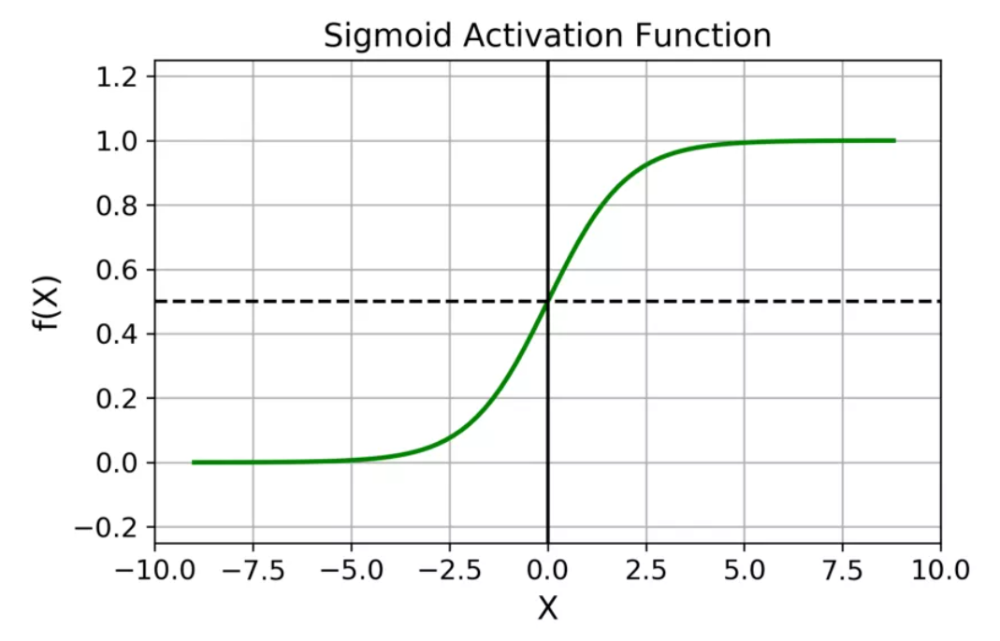

在什么情况下适合使用 Sigmoid 激活函数呢？

- Sigmoid 函数的输出范围是 0 到 1。由于输出值限定在 0 到 1，因此它**对每个神经元的输出进行了归一化**；
- **用于将预测概率作为输出的模型。由于概率的取值范围是 0 到 1**，因此 Sigmoid 函数非常合适；
- **梯度平滑，避免「跳跃」的输出值**；
- **函数是可微的**。这意味着可以找到任意两个点的 sigmoid 曲线的斜率；
- **明确的预测，即非常接近 1 或 0**。

Sigmoid 激活函数有哪些缺点？

- **倾向于梯度消失**；
- **函数输出不是以 0 为中心的，这会降低权重更新的效率**；
- Sigmoid 函数**执行指数运算，计算机运行得较慢**。

##### Tanh / 双曲正切激活函数

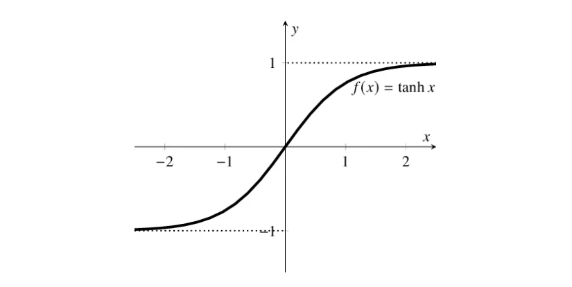

Tanh 激活函数有哪些特点？

- **当输入较大或较小时，输出几乎是平滑的并且梯度较小，这不利于权重更新**。
- tanh 的输出间隔为 1，并且**整个函数以 0 为中心**，比 sigmoid 函数更好；
- 在 tanh 图中，负输入将被强映射为负，而零输入被映射为接近零。

- 注意：在一般的二元分类问题中，**tanh 函数用于隐藏层，而 sigmoid 函数用于输出层**，但这并不是固定的，需要根据特定问题进行调整。

##### ReLU 激活函数

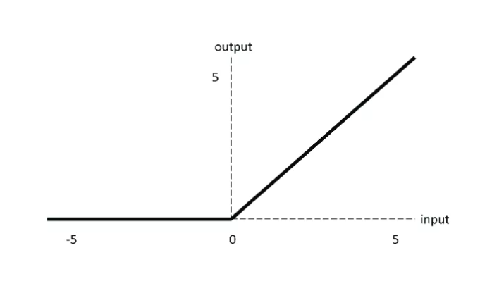

ReLU 函数优缺点？

- 优点：
  - **当输入为正时，不存在梯度饱和问题**。
  - **计算速度快得多**。ReLU 函数中只存在线性关系，因此它的计算速度比 sigmoid 和 tanh 更快。

- 缺点：
  - Dead ReLU 问题。**当输入为负时，ReLU 完全失效**，在正向传播过程中，这不是问题。有些区域很敏感，有些则不敏感。但是在反向传播过程中，如果输入负数，则梯度将完全为零，sigmoid 函数和 tanh 函数也具有相同的问题；
  - 我们发现 ReLU 函数的输出为 0 或正数，这意味着 **ReLU 函数不是以 0 为中心的函数**。

##### Leaky ReLU

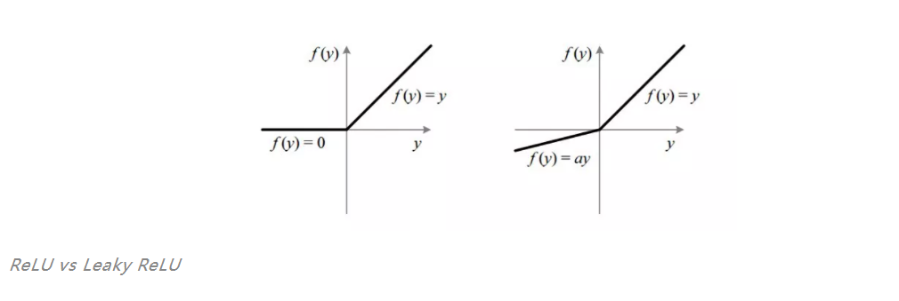

为什么 Leaky ReLU 比 ReLU 更好？

1. Leaky ReLU **通过把 x 的非常小的线性分量给予负输入（0.01x）来调整负值的零梯度（zero gradients）问题**；
2. leak **有助于扩大 ReLU 函数的范围**，通常 a 的值为 0.01 左右；
3. Leaky ReLU 的**函数范围是（负无穷到正无穷）**。

**注意：** 从理论上讲，Leaky ReLU 具有 ReLU 的所有优点，而且 Dead ReLU 不会有任何问题，但在实际操作中，尚未完全证明 Leaky ReLU 总是比 ReLU 更好。

##### ELU

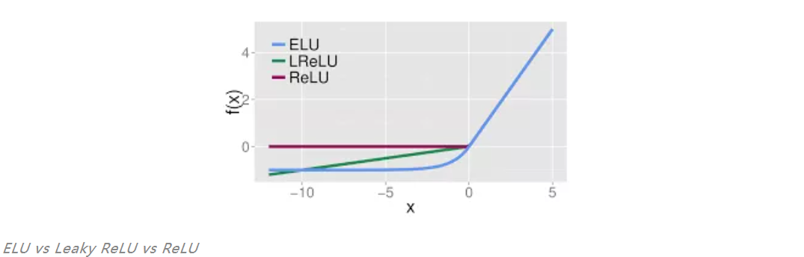

ELU 具有 ReLU 的所有优点，并且：

- 没有 Dead ReLU 问题，**输出的平均值接近 0，以 0 为中心**；
- ELU 通过**减少偏置偏移的影响，使正常梯度更接近于单位自然梯度，从而使均值向零加速学习**；
- ELU 在较小的输入下会饱和至负值，从而**减少前向传播的变异和信息**。

一个小问题是它的**计算强度更高**。与 Leaky ReLU 类似，尽管理论上比 ReLU 要好，但目前在实践中没有充分的证据表明 ELU 总是比 ReLU 好。

##### PReLU（Parametric ReLU）

注意：alpha也是学习参数

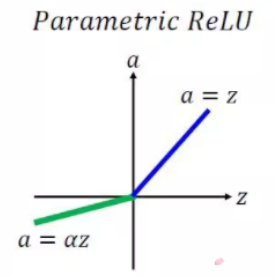

PReLU 的优点如下：

1. 在负值域，**PReLU 的斜率较小，这也可以避免 Dead ReLU 问题**。
2. 与 ELU 相比，**PReLU 在负值域是线性运算**。尽管斜率很小，但不会趋于 0。

##### Softmax

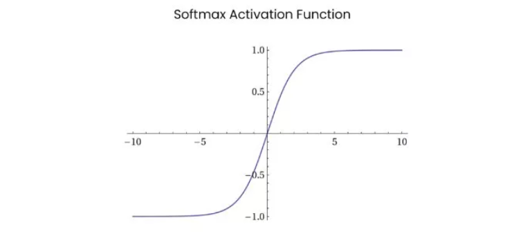

Softmax 函数的分母结合了原始输出值的所有因子，这意味着 **Softmax 函数获得的各种概率彼此相关**。

Softmax 激活函数的主要缺点是：

1. 在**零点不可微**；
2. **负输入的梯度为零**，这意味着对于该区域的激活，权重不会在反向传播期间更新，因此会产生永不激活的死亡神经元。

##### Swish

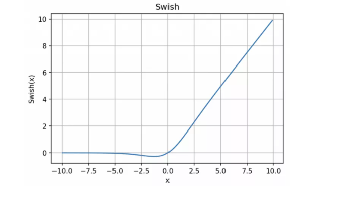

函数表达式：y = x * sigmoid (x)

Swish 的设计受到了 LSTM 和高速网络中 gating 的 sigmoid 函数使用的启发。我们使用相同的 gating 值来简化 gating 机制，这称为 self-gating。

self-gating 的优点在于它只需要简单的标量输入，而普通的 gating 则需要多个标量输入。这使得诸如 Swish 之类的 self-gated 激活函数能够轻松替换以单个标量为输入的激活函数（例如 ReLU），而无需更改隐藏容量或参数数量。

Swish 激活函数的主要优点如下：

- 「无界性」有助于防止慢速训练期间，梯度逐渐接近 0 并导致饱和；（同时，有界性也是有优势的，因为有界激活函数可以具有很强的正则化，并且较大的负输入问题也能解决）；
- **导数恒 > 0**；
- **平滑度在优化和泛化中起了重要作用**。

##### Maxout

在 Maxout 层，激活函数是输入的最大值，因此只有 2 个 maxout 节点的多层感知机就可以拟合任意的凸函数。

##### Softplus

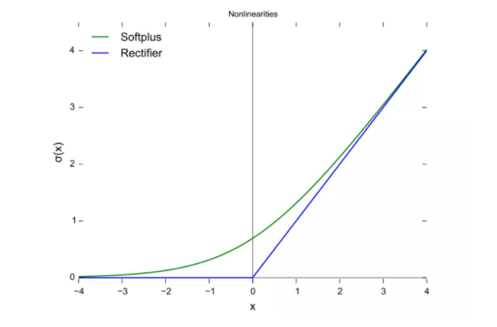

Softplus 函数：f（x）= ln（1 + exp x）

Softplus 函数类似于 ReLU 函数，但是相对较平滑，像 ReLU 一样是单侧抑制。它的接受范围很广：(0, + inf)

#### ReLU激活函数为什么会出现死神经元，解决办法？

- **ReLu激活函数的输入都是负的，那么该神经元再也无法学习，称为神经元”死亡“问题。**

- 输入为负值时，ReLU的梯度为0造成神经元死亡。还有Learning rate太高导致在训练过程中参数更新太大 。

- 解决办法主要有：

  1. **优化参数**。 

  2. **避免将learning rate设置太大**，或者使用Adam等自动调节learning rate的方法。
  3. **更换激活函数**。

#### 激活函数如何选择？

- 深度学习往往需要大量时间来处理大量数据，模型的收敛速度是尤为重要的。所以，总体上来讲，训练深度学习网络尽量使用zero-centered数据 (可以经过数据预处理实现) 和zero-centered输出。所以要尽量选择输出具有zero-centered特点的激活函数以加快模型的收敛速度；
- 如果使用 ReLU，那么一定要小心设置 learning rate，而且要注意不要让网络出现很多 “dead” 神经元，如果这个问题不好解决，那么可以试试 Leaky ReLU、PReLU 或者 Maxout；
- 最好不要用 sigmoid，你可以试试 tanh，不过可以预期它的效果会比不上 ReLU 和 Maxout.

## 正则化

#### 正则化 是什么？

- 我们所说的正则化，就是在原来的loss function的基础上，加上了一些正则化项或者称为模型复杂度惩罚项。
- 对某一问题加以先验的限制或约束以达到某种特定目的的一种手段或操作。在算法中使用正则化的目的是防止模型出现过拟合。

#### 什么是 L0 正则化 ？

- 介绍：指向量中非零元素的个数，希望参数中大部分元素为0，希望参数是稀疏的；
- 直观理解：即将所有的非零项都作为1加起来，然后再用步长λ调节。意思很明显，每一个对预测产生了贡献的参数，我都惩罚一次，不多不少，大家都一样。
- 缺点：难以优化（存在NP难问题）

#### 什么是 L1 （稀疏规则算子 Lasso regularization）正则化 ？

- 介绍：指向量中各元素绝对值之和，是 L0 正则项的最优凸近似；
- 直观理解：即将所有的绝对值值相加。
- 优点：
  - 比 L0 容易优化求解，L0存在NP难问题，所以 使用 较多；
  - L1范数是L0范数的最优凸近似；

- 参数稀疏 的 优点：
  - 特征选择：通过将无用特征所对应的权重设为0，以去除无用特征；
  - 可解释性：因为无用特征的权重对应权重都为0，所以只需要介绍权重不为 0 的特征；

#### 什么是 L2 正则化（岭回归 Ridge Regression 或者 权重衰减 Weight Decay）正则化 ？

- 介绍：向量各元素的平方和然后求平方根，防止模型出现过拟合的问题
- 直观理解：所有项的平方和相加最后开根
- 作用：防止过拟合问题
- 优点：
  - 防止过拟合，提升模型的泛化能力;
  - 有助于处理 condition number 不好的情况下矩阵求逆很困难的问题。

#### L1 vs L2 ？

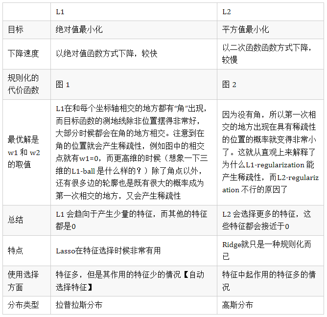

- 详细对比解释L1与L2参考：[比较全面的L1和L2正则化的解释](https://t.hk.uy/aMuZ)

#### 什么是 dropout？

- 方式：通过以概率p主动临时性地忽略掉神经网站中的部分隐藏节点来防止过拟合，即让这些神经元以一定概率不工作；

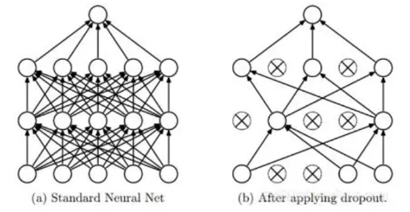

#### dropout 在训练和测试过程中如何操作？

- **训练过程**：在训练开始时，**随机删除一些隐藏层神经元，即认为这些神经元不存在**，同时保持输入层与输出层的神经元个数不变，按照反向传播学习算法对神经网络中的参数进行学习更新（被删除的节点不参与更新)。在这个“残缺”的网络中，让神经网络学习数据中的局部特征（即部分分布式特征）。在多个“残缺”之网（相当于多个简单网络）中实施特征，总要比仅在单个健全网络上进行特征学习，其泛化能力来得更加健壮。这里的“泛化”，实际上就是适应各种情况的能力。如果神经网络仅仅在训练集合上表现好（好比“窝里横”），而在应对其他新情况表现不佳，就表明陷入“过拟合”状态，其实就是泛化能力差。
- **在测试阶段**：将**参与学习的节点和那些被隐藏的节点以一定的概率p加权求和**，综合计算得到网络的输出。对于这样的“分分合合”的学习过程，有学者认为，“丢弃学习”可视为一种集成学习（Ensemble Learning）。

#### dropout 如何防止过拟合?

- 在Dropout每一轮训练过程中随机丢失神经元的操作相当于多个DNNs进行取平均，因此用于预测具有vote的效果。
- **减少神经元之间复杂的共适应性。当隐藏层神经元被随机删除之后，使得全连接网络具有了一定的稀疏化，从而有效地减轻了不同特征的协同效应**。也就是说，有些特征可能会依赖于固定关系的隐含节点的共同作用，而通过Dropout的话，就有效地组织了某些特征在其他特征存在下才有效果的情况，增加了神经网络的鲁棒性。

## 判别式（discriminative）模型 vs. 生成式(generative)模型

#### 什么是判别式模型？

- 判别模型是**直接对P(Y|X)建模**，就是说，直接根据X特征来对Y建模训练。

#### 判别式模型是思路是什么？

1. 对P(Y|X)建模；
2. 对所有的样本只构建一个模型，确认总体判别边界；
3. 观测到输入什么特征，就预测最可能的label；

#### 判别式模型的优点是什么？

- **对数据量要求没生成式的严格**，**速度也会快**，小数据量下准确率也会好些。

#### 什么是生成式模型？

在模型训练中，我学习到的是X与Y的联合模型 P(X,Y) ，也就是说，我**在训练阶段是只对 P(X,Y) 建模**，我需要确定维护这个联合概率分布的所有的信息参数。完了之后**在inference再对新的sample计算 P(Y|X) ，导出 Y**,但这已经不属于建模阶段了。

#### 生成式模型是思路是什么？

1. 对 P(X,Y) 建模；
2. 这里我们主要讲分类问题，所以是要对每个label（ yi）都需要建模，最终选择最优概率的label为结果，所以没有什么判别边界。（对于序列标注问题，那只需要构件一个model）；
3. 中间生成联合分布，并可生成采样数据。

#### 生成式模型的优点是什么？

所包含的信**息非常齐全**，我称之为“上帝信息”，所以不仅可以用来输入label，还可以干其他的事情。生成式模型关注结果是如何产生的。

#### 生成式模型的缺点是什么？

但是生成式模型**需要非常充足的数据量以保证采样到了数据本来的面目**，所以**速度相比之下较慢**。

# 机器学习算法

## 感知器

## K近邻

## 朴素贝叶斯

## 决策树

## 逻辑回归

#### 什么是逻辑回归？

- LR是Logistic Regression Classifier，本质上是线性回归，特殊之处在于特征到结果的映射中加入了一层逻辑函数g(z)，即先把特征线性求和，然后使用函数g(z)作为假设函数来预测。g(z)可以将连续值映射到0 和1。逻辑回归使用的g(z)函数是sigmoid函数。因此**逻辑回归=线性回归 + sigmoid**。

#### 逻辑回归的优点？

1. 它是**直接对分类可能性进行建模**，无需实现假设数据分布，这样就避免了假设分布不准确所带来的问题；
2. 它不是仅预测出“类别”，而是**可得到近似概率预测**，这对许多需利用概率辅助决策的任务很有用；
3. 逻辑回归函数是任意阶可导的凸函数，有很好的数学性质，现有的许多数值优化算法都可直接用于求取最优解。
4. 对于线性数据，（大部分时候）逻辑回归的拟合和计算都非常快，计算效率优于SVM和随机森林

## 最大熵模型

## 支持向量机

#### 什么是SVM？

- 支持向量机的提出基于统计学习理论和结构风险最小化准则，统计学习理论避免分类模型受样本量的限制，结构风险最小化准则避免模型训练时出现的模型问题。在这样的背景下，支持向量机技术的推广及其判别能力较强，其最终的目的是根据输入数据样本寻找到一个最优分类超平面。

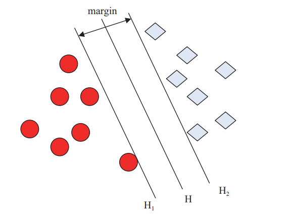

#### 支持向量机核函数种类？

- 线性核
- 多项式核
- Sigmoid核
- Gauss径向基核(RBF)

#### 手推SVM？

#### 讲一讲SVM，知道多少说多少？为什么要用对偶问题求解?(今日头条)

1. 首先是我们有不等式约束方程，这就需要我们写成min max的形式来得到最优解。而这种写成这种形式对x不能求导，所以我们需要转换成max min的形式，这时候，x就在里面了，这样就能对x求导了。而为了满足这种对偶变换成立，就需要满足KKT条件（KKT条件是原问题与对偶问题等价的必要条件，当原问题是凸优化问题时，变为充要条件）。

2. 对偶问题将原始问题中的约束转为了对偶问题中的等式约束

3. 方便核函数的引入

4. 改变了问题的复杂度。由求特征向量w转化为求比例系数a，在原始问题下，求解的复杂度与样本的维度有关，即w的维度。在对偶问题下，只与样本数量有关。

#### 支持向量机中到底什么是支持向量，即支持向量中的向量是指什么？

- 支持向量本质是向量，而这些向量却起着很重要的作用，如果做分类，它们就是离分界线最近的向量。也就是说分界面是靠这些向量确定的，它们支撑着分类面。即就是离最优分类平面最近的离散点,也可以称为向量。

#### 既然有很多的核函数，针对具体问题该怎么选择？ 如果使用核函数向高维空间映射后，问题仍然是线性不可分的，那怎么办？

- 对核函数的选择，现在还缺乏指导原则，各种实验的观察结果（不光是文本分类）的确表明，某些问题用某些核函数效果很好，用另一些就很差，但是一般来讲，径向基核函数（rbf）是不会出太大偏差的一种首选。（在做文本分类系统的时候，使用径向基核函数，没有参数调优的情况下，绝大部分类别的准确和召回都在85%以上，可见。
- 对于松弛变量来说。它是控制近似可分样本的对错分样本惩罚程度C，而这个参数没有一定的公式作参考，只能凭借经验核试验选取。

#### SVM中惩罚参数C的理解（正则化参数对支持向量数的影响）？

- C理解为调节优化方向中两个指标（间隔大小，分类准确度）偏好的权重
- soft-margin SVM针对hard-margin SVM容易出现的过度拟合问题，适当放宽了margin的大小，容忍一些分类错误（violation），把这些样本当做噪声处理，本质上是间隔大小和噪声容忍度的一种trade-off，至于具体怎么trade-off，对哪个指标要求更高，那就体现在C这个参数上了。
  - 当C趋于无穷大时，这个问题也就是不允许出现分类误差的样本存在，那这就是一个hard-margin SVM问题（过拟合）
  - 当C趋于0时，我们不再关注分类是否正确，只要求间隔越大越好，那么我们将无法得到有意义的解且算法不会收敛。（欠拟合）

#### 如何解决线性不可分问题？

#### 高维一定线性可分？（面试题）

#### 传统机器学习算法了解吗，比如XGBoost和SVM这些？（面试题）

#### SVM的核函数了解多少？（面试题）

#### SVM引入核函数本质？（面试题）

- 提高维度，增加模型复杂度

#### 介绍下SVM以及它的核函数（面试题）

#### SVM加核函数用过吗？讲一讲其中的差别？(今日头条)（面试题）

- 训练样本多，维度大就可以用核函数；如果样本少，用核函数比较容易过拟合

#### SVM核函数的选择？多项式核和RBF核的关系？（面试题）

#### 核函数的选择就是svm中的难点，也是核心问题（举出不同的例子？）（面试题）

#### 核函数是什么?高斯核映射到无穷维是怎么回事?（面试题）

#### 一个核函数都隐式定义了一个成为“再生核希尔伯特空间”的特征空间(iff条件)？（面试题）

#### 为什么SVM要引入核函数？

- 当样本在原始空间线性不可分时，可将样本从原始空间映射到一个更高维的特征空间，使得样本在这个特征空间内线性可分。

#### SVM在训练的时候有没有遇到hard example？(今日头条)（面试题）

#### 函数间隔/几何间隔是什么，有什么意义？（面试题）

- 相关关键词：硬间隔最大化（几何间隔）、函数间隔、学习的对偶问题、软间隔最大化（引入松弛变量）、非线性支持向量机（核技巧）、Hinge Loss（面试题）

- SVM中硬间隔和软间隔
  - 硬间隔分类即线性可分支持向量机，软间隔分类即线性不可分支持向量机，利用软间隔分类时是因为存在一些训练集样本不满足函数间隔（泛函间隔）大于等于1的条件，于是加入一个非负的参数 ζ （松弛变量），让得出的函数间隔加上 ζ 满足条件。于是软间隔分类法对应的拉格朗日方程对比于硬间隔分类法的方程就多了两个参数（一个ζ ，一个 β），但是当我们求出对偶问题的方程时惊奇的发现这两种情况下的方程是一致的。下面我说下自己对这个问题的理解。
  - 我们可以先考虑软间隔分类法为什么会加入ζ 这个参数呢？硬间隔的分类法其结果容易受少数点的控制，这是很危险的，由于一定要满足函数间隔大于等于1的条件，而存在的少数离群点会让算法无法得到最优解，于是引入松弛变量，从字面就可以看出这个变量是为了缓和判定条件，所以当存在一些离群点时我们只要对应给他一个ζi，就可以在不变更最优分类超平面的情况下让这个离群点满足分类条件。
  - 综上，我们可以看出来软间隔分类法加入ζ 参数，使得最优分类超平面不会受到离群点的影响，不会向离群点靠近或远离，相当于我们去求解排除了离群点之后，样本点已经线性可分的情况下的硬间隔分类问题，所以两者的对偶问题是一致的。

#### 怎么理解SVM的损失函数?（面试题）

#### 使用高斯核函数，请描述SVM的参数C和σ对分类器的影响（面试题）

#### SVM 为什么可以处理非线性问题？

#### SVM存在什么问题？

-  SVM算法对大规模训练样本难以实施
- 用SVM解决多分类问题存在困难
- 对缺失数据敏感，对参数和核函数的选择敏感

#### SVM和LR的区别与联系？（面试题）

- 相同点：

  - 第一，LR和SVM都是分类算法。

    - 看到这里很多人就不会认同了，因为在很大一部分人眼里，LR是回归算法。我是非常不赞同这一点的，因为我认为判断一个算法是分类还是回归算法的唯一标准就是样本label的类型，如果label是离散的，就是分类算法，如果label是连续的，就是回归算法。很明显，LR的训练数据的label是“0或者1”，当然是分类算法。其实这样不重要啦，暂且迁就我认为它是分类算法吧，再说了，SVM也可以回归用呢。

  - 第二，如果不考虑核函数，LR和SVM都是线性分类算法，也就是说他们的分类决策面都是线性的。

    - 这里要先说明一点，那就是LR也是可以用核函数的，至于为什么通常在SVM中运用核函数而不在LR中运用，后面讲到他们之间区别的时候会重点分析。总之，原始的LR和SVM都是线性分类器，这也是为什么通常没人问你决策树和LR什么区别，决策树和SVM什么区别，你说一个非线性分类器和一个线性分类器有什么区别？

  - 第三，LR和SVM都是监督学习算法。

    - 这个就不赘述什么是监督学习，什么是半监督学习，什么是非监督学习了。

  - 第四，LR和SVM都是判别模型。

    - 判别模型会生成一个表示P(Y|X)的判别函数（或预测模型），而生成模型先计算联合概率p(Y,X)然后通过贝叶斯公式转化为条件概率。简单来说，在计算判别模型时，不会计算联

- 不同点
  - 第一，本质上是其损失函数（loss function）不同。lr的损失函数是 cross entropy loss， adaboost的损失函数是 expotional loss ,svm是hinge loss，常见的回归模型通常用 均方误差 loss。
  - 第二，支持向量机只考虑局部的边界线附近的点，而逻辑回归考虑全局（远离的点对边界线的确定也起作用）。
  - 第三，在解决非线性问题时，支持向量机采用核函数的机制，而LR通常不采用核函数的方法。
  - 第四，线性SVM依赖数据表达的距离测度，所以需要对数据先做normalization，LR不受其影响。
  - 第五，SVM的损失函数就自带正则（损失函数中的1/2||w||^2项），这就是为什么SVM是结构风险最小化算法的原因；而LR必须另外在损失函数上添加正则项。

#### 说LR和SVM损失函数。（面试题）

#### SVM框架下引入Logistic函数:输出条件后验概率？（面试题）

#### 感知机的对偶形式和SVM对偶形式的对比（面试题）

#### 为什么要用对偶形式？如何理解对偶函数的引入对计算带来的优势？（面试题）

#### SVM用于回归问题:SVR（面试题）

## 集成学习

### 基础

#### 集成学习的基本思想是什么？

- 结合多个学习器组合成一个性能更好的学习器

#### 集成学习为什么有效？

- 不同的模型通常会在测试集上产生不同的误差；如果成员的误差是独立的，集成模型将显著地比其成员表现更好。

### Boosting

#### 用一句话概括 Boosting？

- Boosting 应用 迭代式学习 的方式进行学习

#### Boosting 的特点是什么？

- Boosting 分类器间存在依赖关系，基学习器之间存在依赖关系，新的学习器需要根据上一个学习器生成。

#### Boosting 的基本思想是什么？

- s1：先从初始训练集训练一个基学习器；初始训练集中各样本的权重是相同的；
- s2：根据上一个基学习器的表现，调整样本权重，使分类错误的样本得到更多的关注；
- s3：基于调整后的样本分布，训练下一个基学习器；
- s4：测试时，对各基学习器加权得到最终结果；

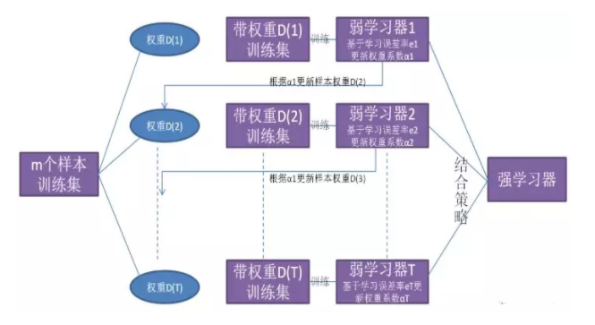

#### Boosting 的特点是什么？

- 每次学习都会使用全部训练样本

#### GBDT 是什么？

- 思想：每一棵树学习的是之前所有树的整体预测和标签的误差；
- 举例说明：假如有个人30岁，我们首先用20岁去拟合，发现损失有10岁，这时我们用6岁去拟合剩下的损失，发现差距还有4岁，第三轮我们用3岁拟合剩下的差距，差距就只有一岁了。如果我们的迭代轮数还没有完，可以继续迭代下面，每一轮迭代，拟合的岁数误差都会减小。

#### Xgboost 是什么？

- 思想：不断地添加树，不断地进行特征分裂来生长一棵树，每次添加一个树，其实是学习一个新函数，去拟合上次预测的残差。当我们训练完成得到k棵树，我们要预测一个样本的分数，其实就是根据这个样本的特征，在每棵树中会落到对应的一个叶子节点，每个叶子节点就对应一个分数，最后只需要将每棵树对应的分数加起来就是该样本的预测值。

### Bagging

#### 用一句话概括 Bagging？

- Bagging 应用 基于并行策略 的方式进行学习

#### Bagging 的特点是什么？

- 基学习器之间不存在依赖关系，可同时生成.

#### Bagging 的基本思想是什么？

- s1：利用自助采样法对训练集随机采样，重复进行 T 次;
- s2：基于每个采样集训练一个基学习器，并得到 T 个基学习器；
- s3：预测时，集体**投票决策**。

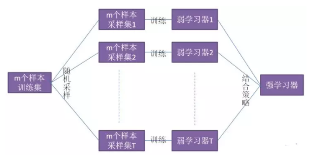

#### Bagging 的基分类器如何选择？

- 所用基分类器最好本身对样本分布较为敏感（不稳定性）

#### Bagging 的优点 是什么？

- 集成后分类器方差比基分类器的小

#### Bagging 的特点是什么？

- 训练每个基学习器时只使用一部分样本；
- 偏好不稳定的学习器作为基学习器。

> 注：所谓不稳定的学习器，指的是对样本分布较为敏感的学习器

#### 随机森林 是什么？

- 思想：用随机的方式建立一个森林，森林里面有很多的决策树组成，随机森林的每一棵决策树之间是没有关联的。在得到森林之后，当有一个新的输 入样本进入的时候，就让森林中的每一棵决策树分别进行一下判断，对于分类算法，看看这个样本应该属于哪一类，然后看看哪一类被选择最多，就预测这个样本为那一类。对回归问题，计算k个模型的均值作为最后的结果。

### Stacking

#### 用一句话概括 Stacking ？

- Stacking 应用 基于串行策略 的方式进行学习

#### Stacking 的特点是什么？

- 初级学习器与次级学习器之间存在依赖关系，初学习器的输出作为次级学习器的输入

#### Stacking 的基本思路是什么？

- s1：先从初始训练集训练 T 个不同的初级学习器;
- s2：利用每个初级学习器的输出构建一个次级数据集，该数据集依然使用初始数据集的标签；
- s3：根据新的数据集训练次级学习器；
- s4：多级学习器的构建过程类似；

### 综合

#### 为什么使用决策树作为基学习器？

- (1). 决策树的表达能力和泛化能力，可以通过剪枝快速调整；
- (2). 决策树可以方便地将**样本的权重**整合到训练过程中；（适合 Boosting 策略）
- (3). 决策树是一种不稳定的学习器； （适合Bagging 策略）
  - 所谓不稳定，指的是数据样本的扰动会对决策树的结果产生较大的影响；

#### 为什么不稳定的学习器更适合作为基学习器？

- 不稳定的学习器容易受到样本分布的影响（方差大），很好的引入了随机性；这有助于在集成学习（特别是采用 Bagging策略）中提升模型的泛化能力。
- 为了更好的引入随机性，有时会随机选择一个属性子集中的最优分裂属性，而不是全局最优（随机森林）

#### 哪些模型适合作为基学习器？

- 决策树
- 神经网络
  - 神经网络也属于不稳定的学习器；
  - 通过调整神经元的数量、网络层数，连接方式初始权重也能很好的引入随机性和改变模型的表达能力和泛化能力

#### Bagging 方法中能使用线性分类器作为基学习器吗？ Boosting 呢？

- Bagging 方法中不推荐：
  - 线性分类器都属于稳定的学习器（方差小），对数据不敏感；
  - 甚至可能因为 Bagging 的采样，导致在训练中难以收敛，增大集成分类器的偏差
- Boosting 方法中可以使用：
  - Boosting 方法主要通过降低偏差的方式来提升模型的性能，而线性分类器本身具有方差小的特点，所以两者有一定相性
  - XGBoost 中就支持以线性分类器作为基学习器

#### Boosting/Bagging 与 偏差/方差 的关系？

- 提升弱分类器性能的原因：
  - Boosting ：降低了偏差
  - Bagging ：降低了方差
- Boosting 方法
  - 基本思路：减小模型的训练误差拟合残差或者加大错类的权重），加强模型的学习能力，减小偏差
  - 缺点：但 Boosting 不会显著降低方差，因为其训练过程中各基学习器是强相关的，缺少独立性。
- Bagging 方法
  - 对 n 个独立不相关的模型预测结果取平均，方差是原来的 1/n
  - 假设所有基分类器出错的概率是独立的，超过半数基分类器出错的概率会随着基分类器的数量增加而下降

#### LR vs GBDT？

- 从模型角度
  - 相同点：
    - 监督学习；
    - 判别模型；
    - 直接对数据的分布建模；
    - 不尝试挖掘隐含变量；
  - 不同点：
    - Logistic Regression：
      - 线性模型；
      - 分类器：线性分类器；
      - VC 维度： d+1;
    - GBDT:
      - 非线性模型;
      - boosting 模型，可以无限分类，具有无限逼近样本 VC 维的特点；
      - VC 维度：远远大于 d+1；

- 从策略角度

  - Logistic Regression：
    - 输出： y = 1 的概率；
    - Loss 损失函数：交叉熵；
    - 准则：最大熵原理，“为了追求最小分类误差，追求最大熵 Loss”;
    - 本质：分类器算法，而且对数据的噪声具有高斯假设；
    - 特征的线性组合求交叉熵的最小化，也就是对特征的线性组合做 logistic，使得Logistic Regression会在特征空间中做线性分界面，适用于分类任务；
    - 方式：采用一种约束参数稀疏的方式；
      - L2 正则整体约束权重系数的均方和，使得权重分布更均匀；
      - L1 正则则是约束权重系数绝对值和，其自带特征选择特性；

  - GBDT：
    - 基分类器：CART，其无论是处理分类还是回归均是将采用回归拟合（将分类问题通过 softmax 转换为回归问题），用当前轮 CART 树拟合前一轮目标函数与实际值的负梯度 ht = -g;
    - 本质：回归算法；
    - 采用 CART 树作为基分类器，其每轮树的特征拟合都是对特征空间做平行于坐标轴的空间分割，所以自带特征选择和可解释性，GBDT 即可处理分类问题也可解决回归问题，只是其统一采用回归思路进行求解（试想，如果不将分类转换为回归问题，GBDT 每轮目标函数旨在拟合上一轮组合模型的负梯度，分类信息无法求梯度，故而依旧是采用 softmax 转换为回归问题进行求解）;
    - 弱算法的个数T，就是迭代T轮。T的大小就影响着算法的复杂度;
    - 步长（Shrinkage）在每一轮迭代中，原来采用 $Ft(x) = F_{t-1}(x) + \alpha_{t}h_{t}(x;wt)$ 进行更新，可以加入步长v，使得一次不更新那么多：

- 从算法角度
  - Logistic Regression
    - 若采用 SGB, Momentum, SGD with Nesterov Acceleration 等算法，只用到了一阶导数信息，
    - 若用 AdaGrad, AdaDelta / RMSProp, Adam, Nadam, 牛顿法则用到了二阶导数信息，
  - GBDT 直接拟合上一轮组合函数的特梯度，只用到了一阶倒数信息，XGBoost 则是用到了二阶导数信息。

- 从特征的角度
  - LR 特征选择方法：不具有特征组合的能力，只是一次性地寻求最大化熵的过程，对每一维的特征都假设独立，因此只具备对已有特征空间进行分割的能力，更不会对特征空间进行升维（特征组合）
  - GBDT 特征选择方法：采用最小化均方损失来寻找分裂特征及对应分裂点，所以自动会在当前根据特征 A 分裂的子树下寻求其他能使负梯度最小的其他特征 B，这样就自动具备寻求好的特征组合的性能，因此也能给出哪些特征比较重要（根据该特征被选作分裂特征的次数）。
  - Logistic Regression不具有特征组合的能力，并假设特征各个维度独立，因此只具有线性分界面，实际应用中，多数特征之间有相关性，只有维度特别大的稀疏数据中特征才会近似独立，所以适合应用在特征稀疏的数据上；
  - GBDT：其更适合处理稠密特征，如 GBDT+LR 的Facebook论文中，对于连续型特征导入 GBDT 做特征组合来代替一部分手工特征工程，而对于 ID 类特征的做法往往是 one-hot 之后直接传入 LR，或者先 hash，再 one-hot 传入树中进行特征工程，而目前的主流做法是直接 one-hot + embedding 来将高维稀疏特征压缩为低纬稠密特征，也进一步引入了语意信息，有利于特征的表达。

## EM算法

## 隐马尔可夫链

## 条件随机场

## 聚类算法

## 主成分分析

## 潜在语义分析

## 概率潜在语义分析

## 马尔科夫链蒙特卡洛

## 潜在迪利克雷分配

## PageRank

© [JackHCC](https://github.com/JackHCC)

