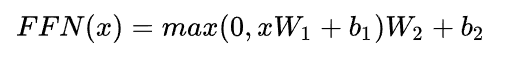

# Transformer

## Q&A

1. **Transformer为何使用多头注意力机制？**（为什么不使用一个头）

   - 多头保证了transformer可以注意到不同子空间的信息，捕捉到更加丰富的特征信息。可以类比CNN中同时使用**多个滤波器**的作用，直观上讲，多头的注意力**有助于网络捕捉到更丰富的特征/信息。**
   - 参考：https://www.zhihu.com/question/341222779

2. **Transformer为什么Q和K使用不同的权重矩阵生成，为何不能使用同一个值进行自身的点乘？** （注意和第一个问题的区别）

   - 使用Q/K/V不相同可以保证在不同空间进行投影，增强了表达能力，提高了泛化能力。
   - 同时，由softmax函数的性质决定，实质做的是一个soft版本的arg max操作，得到的向量接近一个one-hot向量（接近程度根据这组数的数量级有所不同）。如果令Q=K，那么得到的模型大概率会得到一个类似单位矩阵的attention矩阵，**这样self-attention就退化成一个point-wise线性映射**。这样至少是违反了设计的初衷。
   - 参考：https://www.zhihu.com/question/319339652

3. **Transformer计算attention的时候为何选择点乘而不是加法？两者计算复杂度和效果上有什么区别？**

   - K和Q的点乘是为了得到一个attention score 矩阵，用来对V进行提纯。K和Q使用了不同的W_k, W_Q来计算，可以理解为是在不同空间上的投影。正因为 有了这种不同空间的投影，增加了表达能力，这样计算得到的attention score矩阵的泛化能力更高。
   - 为了计算更快。矩阵加法在加法这一块的计算量确实简单，但是作为一个整体计算attention的时候相当于一个隐层，整体计算量和点积相似。在效果上来说，从实验分析，两者的效果和dk相关，dk越大，加法的效果越显著。

4. **为什么在进行softmax之前需要对attention进行scaled（为什么除以dk的平方根）**，并使用公式推导进行讲解

   - 这取决于softmax函数的特性，如果softmax内计算的数数量级太大，会输出近似one-hot编码的形式，导致梯度消失的问题，所以需要scale
   - 那么至于为什么需要用维度开根号，假设向量q，k满足各分量独立同分布，均值为0，方差为1，那么qk点积均值为0，方差为dk，从统计学计算，若果让qk点积的方差控制在1，需要将其除以dk的平方根，是的softmax更加平滑
   - 参考：https://www.zhihu.com/question/339723385/answer/782509914

5. **在计算attention score的时候如何对padding做mask操作？**

   - padding位置置为负无穷(一般来说-1000就可以)，再对attention score进行相加。对于这一点，涉及到batch_size之类的，具体的大家可以看一下抱抱脸实现的源代码，位置在这里：https://github.com/huggingface/transformers/blob/aa6a29bc25b663e1311c5c4fb96b004cf8a6d2b6/src/transformers/modeling_bert.py#L720

6. **为什么在进行多头注意力的时候需要对每个head进行降维？**（可以参考上面一个问题）

   - 将原有的**高维空间转化为多个低维空间**并再最后进行拼接，形成同样维度的输出，借此丰富特性信息，降低了计算量

7. **大概讲一下Transformer的Encoder模块？**

   - 基本结构：Embedding + Position Embedding，Self-Attention，Add + LN，FN，Add + LN

8. **为何在获取输入词向量之后需要对矩阵乘以embedding size的开方？意义是什么？**

   - embedding matrix的初始化方式是xavier init，这种方式的方差是1/embedding size，因此乘以embedding size的开方使得embedding matrix的方差是1，在这个scale下可能更有利于embedding matrix的收敛。

9. **简单介绍一下Transformer的位置编码？有什么意义和优缺点？**

   - 因为self-attention是位置无关的，无论句子的顺序是什么样的，通过self-attention计算的token的hidden embedding都是一样的，这显然不符合人类的思维。因此要有一个办法能够在模型中表达出一个token的位置信息，transformer使用了固定的positional encoding来表示token在句子中的绝对位置信息。

   - [一文读懂Transformer模型的位置编码](https://mp.weixin.qq.com/s/QxaZTVOUrzKfO7B78EM5Uw)
   - [浅谈Transformer模型中的位置表示](https://mp.weixin.qq.com/s/vXYJKF9AViKnd0tbuhMWgQ)
   - [Transformer改进之相对位置编码RPE](https://mp.weixin.qq.com/s/NPM3w7sIYVLuMYxQ_R6PrA)
   - [如何优雅地编码文本中的位置信息？三种positioanl encoding方法简述](https://mp.weixin.qq.com/s/ENpXBYQ4hfdTLSXBIoF00Q)
   - [相对位置编码一)Relative Position Representatitons RPR - Transformer](https://www.cnblogs.com/shiyublog/p/11185625.html)
   - [相对位置编码(二) Relative Positional Encodings - Transformer-XL](https://www.cnblogs.com/shiyublog/p/11236212.html)

10. **你还了解哪些关于位置编码的技术，各自的优缺点是什么？**（参考上一题）

    - **相对位置编码（RPE）**1.在计算attention score和weighted value时各加入一个可训练的表示相对位置的参数。2.在生成多头注意力时，把对key来说将绝对位置转换为相对query的位置3.复数域函数，已知一个词在某个位置的词向量表示，可以计算出它在任何位置的词向量表示。前两个方法是词向量+位置编码，属于亡羊补牢，复数域是生成词向量的时候即生成对应的位置信息。

11. **简单讲一下Transformer中的残差结构以及意义。**

    - 就是ResNet的优点，解决梯度消失

12. **为什么transformer块使用LayerNorm而不是BatchNorm？LayerNorm 在Transformer的位置是哪里？**

    - LN：针对每个样本序列进行Norm，没有样本间的依赖。对一个序列的不同特征维度进行Norm
    - CV使用BN是认为channel维度的信息对cv方面有重要意义，如果对channel维度也归一化会造成不同通道信息一定的损失。而同理nlp领域认为句子长度不一致，并且各个batch的信息没什么关系，因此只考虑句子内信息的归一化，也就是LN。

13. **简答讲一下BatchNorm技术，以及它的优缺点。**

    - 优点：
      - 第一个就是可以解决内部协变量偏移，简单来说训练过程中，各层分布不同，增大了学习难度，BN缓解了这个问题。当然后来也有论文证明BN有作用和这个没关系，而是可以使**损失平面更加的平滑**，从而加快的收敛速度。
      - 第二个优点就是缓解了**梯度饱和问题**（如果使用sigmoid激活函数的话），加快收敛。
    - 缺点：
      - 第一个，batch_size较小的时候，效果差。这一点很容易理解。BN的过程，使用 整个batch中样本的均值和方差来模拟全部数据的均值和方差，在batch_size 较小的时候，效果肯定不好。
      - 第二个缺点就是 BN 在RNN中效果比较差。

14. **简单描述一下Transformer中的前馈神经网络？使用了什么激活函数？相关优缺点？**

    - ReLU

      

15. **Encoder端和Decoder端是如何进行交互的？**（在这里可以问一下关于seq2seq的attention知识）

    - Cross Self-Attention，Decoder提供Q，Encoder提供K，V

16. **Decoder阶段的多头自注意力和encoder的多头自注意力有什么区别？**（为什么需要decoder自注意力需要进行 sequence mask)

    - 让输入序列只看到过去的信息，不能让他看到未来的信息

17. **Transformer的并行化提现在哪个地方？Decoder端可以做并行化吗？**

    - Encoder侧：模块之间是串行的，一个模块计算的结果做为下一个模块的输入，互相之前有依赖关系。从每个模块的角度来说，注意力层和前馈神经层这两个子模块单独来看都是可以并行的，不同单词之间是没有依赖关系的。
    - Decode引入sequence mask就是为了并行化训练，Decoder推理过程没有并行，只能一个一个的解码，很类似于RNN，这个时刻的输入依赖于上一个时刻的输出。

18. **简单描述一下wordpiece model 和 byte pair encoding，有实际应用过吗？**

    - 传统词表示方法无法很好的处理未知或罕见的词汇（OOV问题），传统词tokenization方法不利于模型学习词缀之间的关系”
    - BPE（字节对编码）或二元编码是一种简单的数据压缩形式，其中最常见的一对连续字节数据被替换为该数据中不存在的字节。后期使用时需要一个替换表来重建原始数据。
    - 优点：可以有效地平衡词汇表大小和步数（编码句子所需的token次数）。
    - 缺点：基于贪婪和确定的符号替换，不能提供带概率的多个分片结果。

19. **Transformer训练的时候学习率是如何设定的？Dropout是如何设定的，位置在哪里？Dropout 在测试的需要有什么需要注意的吗？**

    - Dropout测试的时候记得对输入整体呈上dropout的比率

20. **引申一个关于bert问题，bert的mask为何不学习transformer在attention处进行屏蔽score的技巧？**

    - BERT和transformer的目标不一致，bert是语言的预训练模型，需要充分考虑上下文的关系，而transformer主要考虑句子中第i个元素与前i-1个元素的关系。